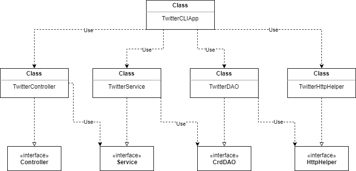

# Introduction
The purpose of this application was to create a Twitter Command Line Interface
that is able to create, search, and delete tweets in real time based on the users input.
The application uses the Twitter REST API to enable these functionalities through an HTTP
Client to run the requests and uses the Jackson Library to parse and convert the JSON objects
to Tweet Objects. This application is packaged using Docker, where user's can pull the image 
from DockerHub to be implemented. The technologies used to create this application are as 
follow:

- Java
- Maven
- Twitter REST API
- Spring 
- Apache HTTP
- Docker

# Quick Start
Before running the application  you must set environment variables for Twitter authentication.
- Twitter Consumer API Key (consumerKey)
- Twitter Consumer API Secret Key (consumerSecret)
- Twitter Access Token (accessToken)
- Twitter Access Token Secret (tokenSecret)

An example of the command for setting these variables is as follows:

```shell
$ export consumerKey = 'YOUR_VALUE'
```

To run the application after, use the following command:

- Usage: `TwitterCLIApp post|show|delete [options]`

## Maven

The Application was packaged using Maven. The following steps depicted below show how this was done.

```shell
# Build package using maven
mvn clean package

# Run jar file
java  -jar -cp target/twitter-1.0-SNAPSHOT.jar post|show|delete [options]
```

## Docker

This Application was deployed with Docker. To run the Application in docker, the following steps have to be taken:

```shell
# pull docker image
docker pull AbdulSamadSethi/twitter

#Create and run docker container
docker run --rm \
-e consumerKey=YOUR_VALUE \
-e consumerSecret=YOUR_VALUE \
-e accessToken=YOUR_VALUE \
-e tokenSecret=YOUR_VALUE \

AbdulSamadSethi/twitter post|show|delete [options]
```

# Design
## UML diagram



- `TwitterDAO`: The DAO layer is the Data Access Layer, which essentially communicates with the HTTP Client and
the Twitter Rest API to create DTOs and according to the specifications

- `TwitterService`: The service layer contains all the business logic of the application and interacts with 
the `twitterDAO`. This layer validates the actual information/data within the arguments to ensure proper standards/syntax.

- `TwitterController`: The controller interacts with the client and parses user input to validate they are in correct 
format before sending them to the service layer.

- `TwitterCLIApp`: This is the class that initiates all dependent components and calls the `run` method, which allows
the user to input the command-line arguments. It also performs an HTTP request and then prints the response body tweets.


## Models

This application required the implementation of 5 classes to represent a simplified version of the Tweet Model. The
primary reason for this was to account for the conversion to a .JSON file.

- `Tweet`: Simplified version of the Twitter Tweet model
- `Entities`: Contains `Hashtag` and `UserMention`
- `Hashtag`: Shows hashtag text in a posted tweet
- `UserMention`: Shows users that have been mentioned in a posted tweet
- `Coordinates`: A list containing longitude and latitude coordinates representing the location of the tweet.

## Spring
In this application, the dependencies are handled using Spring framework. Java class annotations are implemented
to signify the beans, and their use cases as well as the use of the `@Autowired` tag to inject their dependencies to
the constructor. In this application the components are organized as listed below:

- `@Component`:`TwitterCLIApp`, `TwitterHttpHelper`
- `@COntroller`:`TwitterController`
- `@Service`:`TwitterService`
- `@Repository`:`TwitterDAO`

# Test
JUnit was used to perform integration tests on all classes and Mockito framework was used to test classes
with dependency utilizing the ability to mock the dependency.

## Deployment
First packaged the program into a jar file, and then using the jar file for the Dockerfile to use when 
creating the image of the whole application. After the image creation, it was tested on the CLI then pushed 
to DockerHub.

# Improvements

- Pull coordinate location of user from the device location, rather than user entering the longitude and latitude.
- Allow users to edit and update a tweet that has already been posted
- Allow the user to retrieve a tweet with a parameter other than the tweet id.